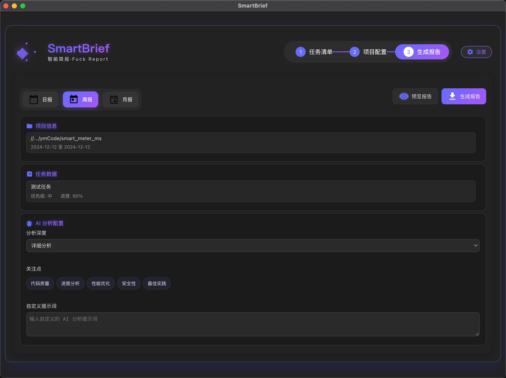
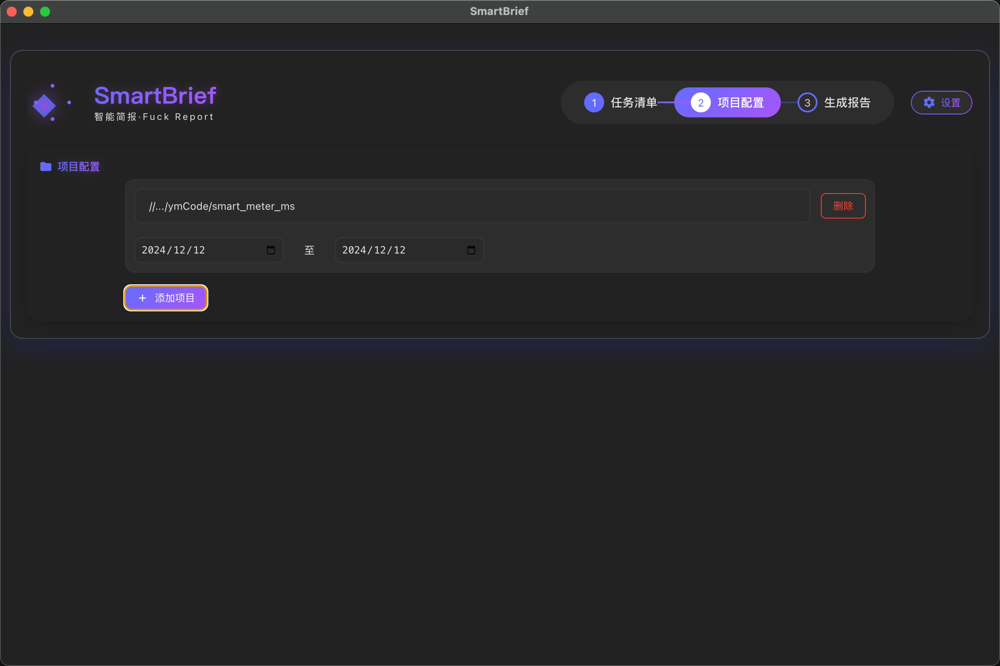
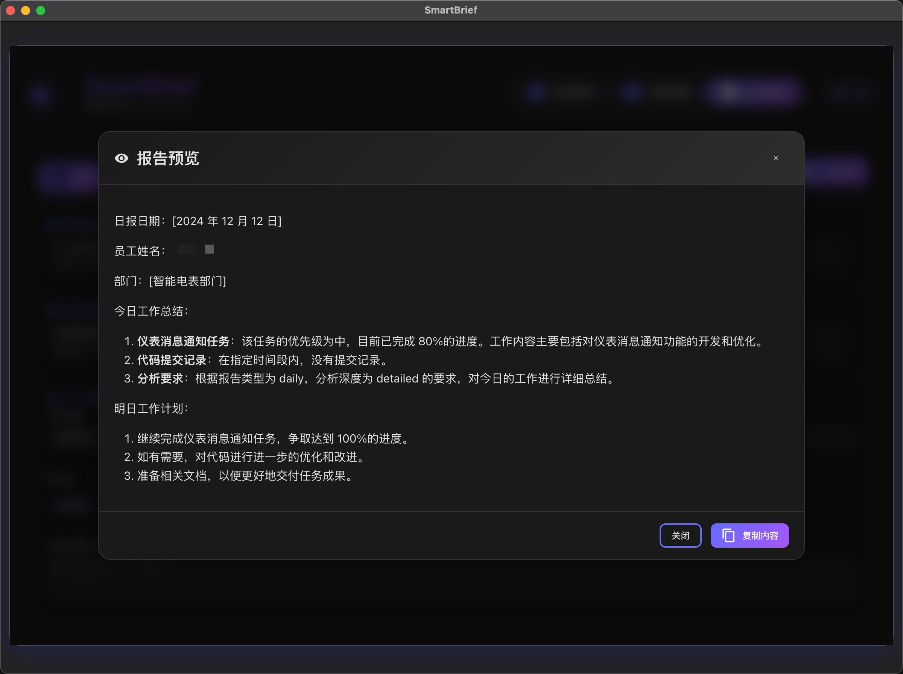

# SmartBrief - AI 智能工作报告生成器

  

    
    

      <h1 style="margin: 0; font-size: 2.5em; background: linear-gradient(135deg, #646cff 0%, #a855f7 100%); -webkit-background-clip: text; -webkit-text-fill-color: transparent;">
        智能简报
      </h1>
      

        Fuck Report
      

    

  

## 🌟 项目介绍

SmartBrief 是一款基于 AI 的智能工作报告生成工具，可以自动分析项目代码提交记录和任务数据，快速生成日报、周报和月报。

### ✨ 主要特性

- 🤖 **AI 智能分析** - 支持多种大语言模型，智能分析工作内容
- 📊 **Git 提交分析** - 自动提取和分析 Git 提交记录
- 📝 **任务追踪** - 可视化任务管理和进度跟踪
- 🎨 **自定义模板** - 灵活配置报告模板和分析维度
- 💾 **本地数据存储** - 所有数据本地存储，安全可靠
- 🌈 **界面美观** - 现代化深色主题 UI 设计

## 📦 安装使用

### 环境要求

- Node.js >= 14
- Git

### 安装步骤

1️⃣ **导入任务数据**
   - 导入或填写任务数据信息

  

2️⃣ **配置模板**

   -  导入本地Git项目
   -  选择报告模板
   -  选择时间范围
   -  自定义关键词
<!-- 插入图片 -->

  

3️⃣ **一键生成**

   -  AI智能分析
   -  实时预览

  

## 🛠️ 技术栈

| 🏗️ 框架 | 🎨 UI | 🔧 工具 |
|---------|-------|---------|
|  |  |  |
|  |  |  |
|  |  |  |
|  |  |  |

### 主要依赖

- **框架核心**
  - Electron - 跨平台桌面应用开发框架
  - Vue 3 - 渐进式 JavaScript 框架
  - Vue Router - 官方路由管理器
  - Vuex - 状态管理模式和库

- **UI 组件**
  - Element Plus - 基于 Vue 3 的组件库
  - DOMPurify - XSS 防护
  - Marked - Markdown 解析器

- **工具库**
  - Vite - 现代前端构建工具
  - Simple Git - Git 操作库
  - Moment.js - 日期处理库
  - Axios - HTTP 客户端
  - Electron Store - 数据持久化存储

## 🤝 参与贡献

  

欢迎参与项目贡献！请查看我们的[贡献指南](CONTRIBUTING.md)。

## 📄 开源协议

MIT License © 2024 [Your Name](https://github.com/yourusername)

---

  
  **用 ❤️ 打造**
  
  [官网](https://smartbrief.com) · [文档](https://docs.smartbrief.com) · [反馈](https://github.com/yourusername/smartbrief/issues)

